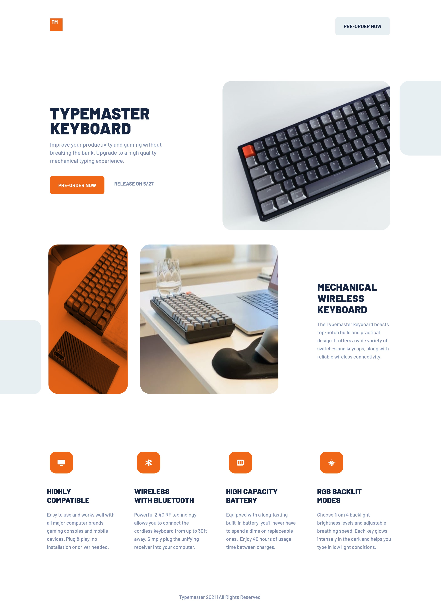

# Typemaster Pre-Launch Landing Page

## Table of contents

- [Overview](#overview)
  - [The challenge](#the-challenge)
  - [Screenshot](#screenshot)
  - [Links](#links)
- [My process](#my-process)
  - [Built with](#built-with)
  - [What I learned](#what-i-learned)
  - [Continued development](#continued-development)
- [Author](#author)

## Overview

This webpage was designed to improve my page design skills and build awareness of helpful SCSS functions.

### Screenshot



### Links

- Live Site URL: [Type-masters](https://type-masters.netlify.app)

## My process

### Built with

- Semantic HTML5 markup
- Sass/Scss custom properties
- Flexbox
- SCSS Grid
- Mobile-first workflow

### What I learned

Initially starting this project I decided to rely heavily on the CSS grid, but realized Flexbox would be a better approach for the majority of the webpage. I had to change some the container portions to switch from CSS grid to Flexbox, but that didn't take too long. I found that completing this project using a Mobile-first workflow saved me from having to make more specialized breakpoints. Using min-width instead of max-width for most breakpoints ensures that all screen types will be accounted for upon completion of the page design.

I had trouble matching the orange keyboard container color, but finally managed to make it work with:

```css
mix-blend-mode: multiply;
```

mix-blend-mode has many functions useful for controlling how to blend overlay with pictures.

### Continued development

Moving forward I will most likely favor a Mobile-first workflow. Once I complete the setup of the page including any JavaScript I need, I spend less time adjusting the screen sizes.

## Author

- Website - [Jason Nembhard](https://www.jasonnembhard.com)
- Frontend Mentor - [@jNembhard](https://www.frontendmentor.io/profile/jNembhard)
